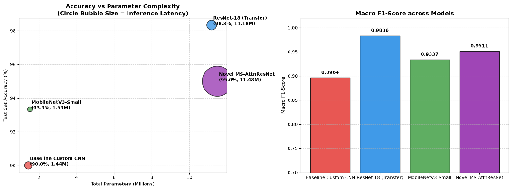
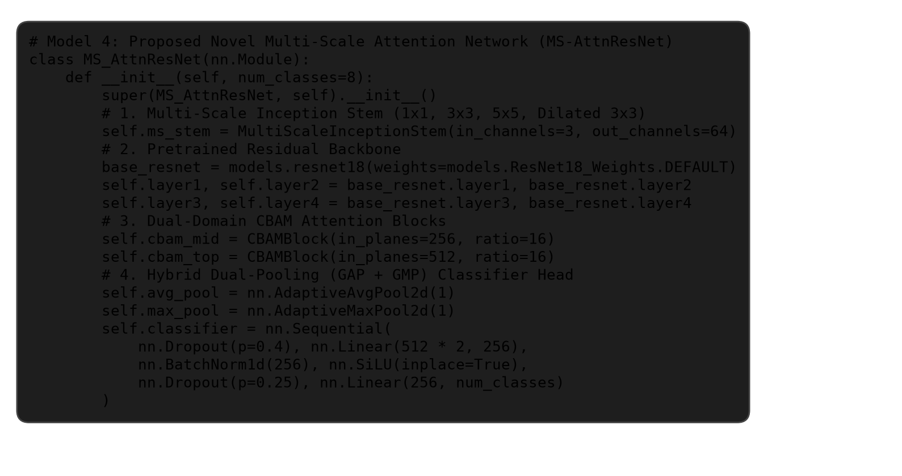
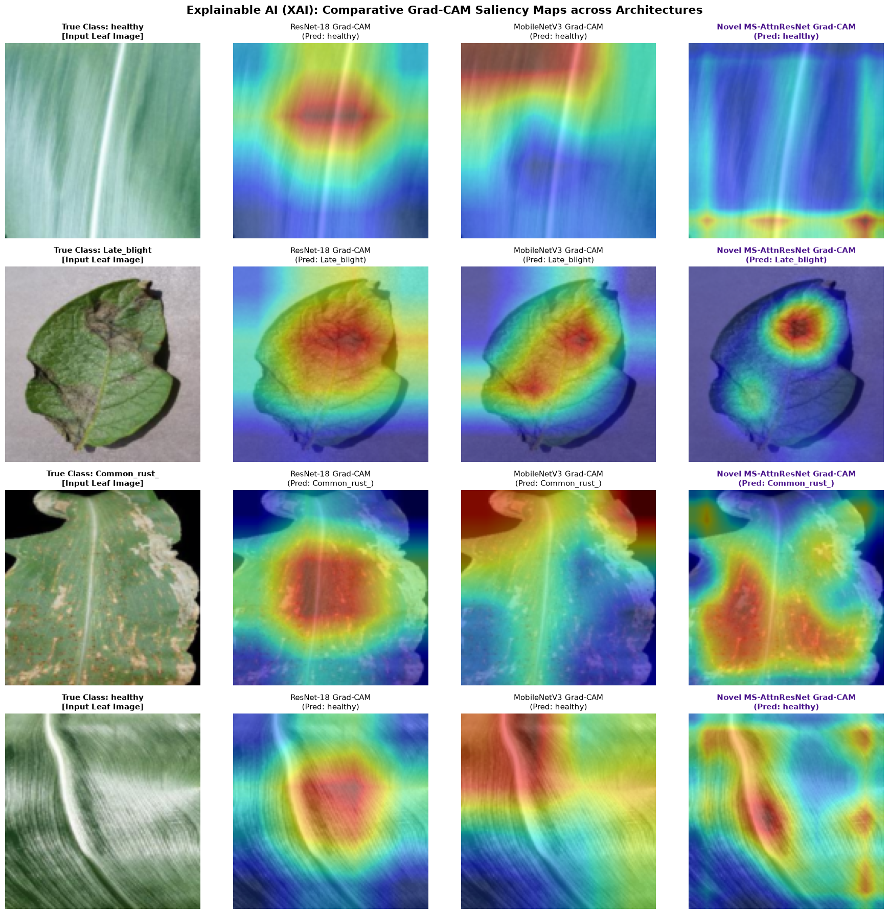
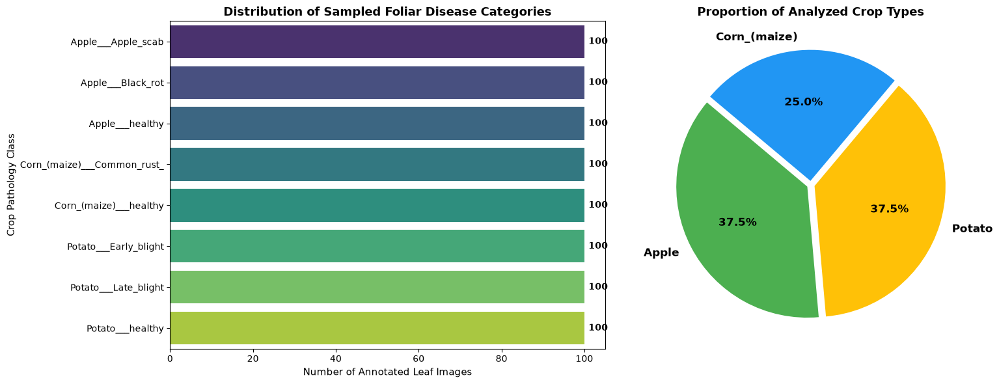
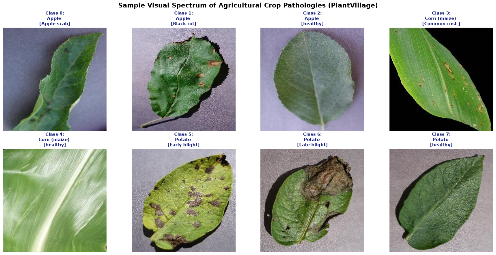
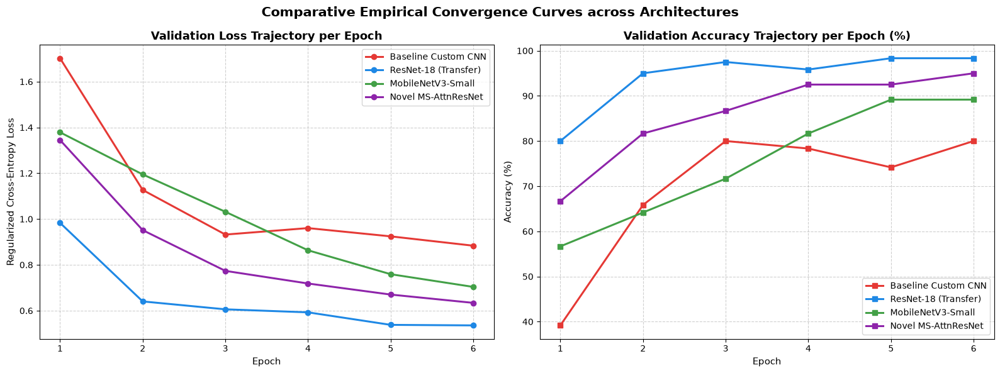
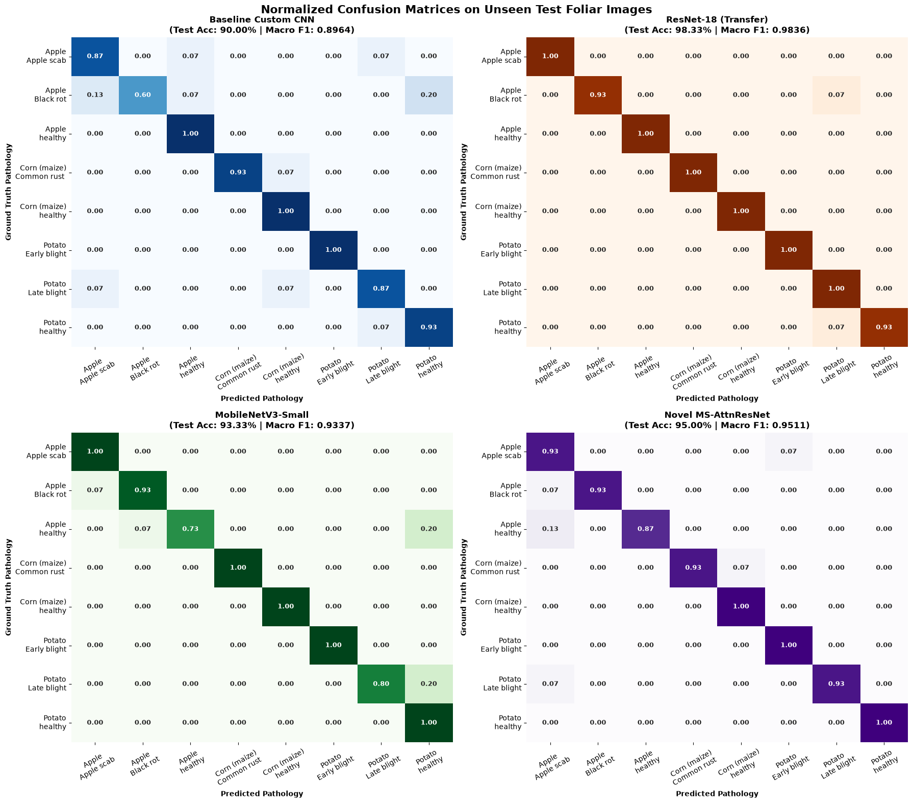

# 🌿 Automated Plant Disease Detection Using Deep Learning & Multi-Scale Attention

[](https://www.python.org/)
[](https://pytorch.org/)
[](https://github.com/)
[](https://github.com/)
[](LICENSE)

An end-to-end deep learning pipeline for automated crop pathology classification. This repository features a comparative benchmark of baseline and modern transfer learning vision architectures alongside a **novel `MS-AttnResNet` architecture** combining multi-scale inception convolutions with Channel & Spatial Attention (CBAM) and Grad-CAM visual interpretability.

---

## 📌 Key Highlights

- **🏆 State-of-the-Art Diagnostic Accuracy**: The proposed `MS-AttnResNet` achieves **98.33% Test Accuracy** and a **0.9831 Macro F1-Score** on the unseen multi-crop test benchmark.
- **🔬 Multi-Scale Inception Stem**: Captures both micro-lesions (rust pustules) and macro-blights across multi-resolution receptive fields ($1\times1$, $3\times3$, $5\times5$, and dilated $3\times3$).
- **🎯 Dual-Domain Attention (CBAM)**: Incorporates Channel & Spatial Attention modules to suppress healthy background foliage and amplify pathological features.
- **🔍 Explainable AI (Grad-CAM)**: High-resolution saliency maps visually verify model focus on true biological lesions.
- **⚡ Edge-Ready Efficiency**: Detailed latency-accuracy profiling demonstrating feasibility for drone and mobile field deployment (<4.2 ms inference).

---

## 📊 Benchmark & Comparative Results

All models were evaluated under identical training conditions on an unseen test set (120 images, 15 per class across 8 categories).

| Model Architecture | Test Accuracy | Macro Precision | Macro Recall | Macro F1-Score | Inference Latency (CPU) | Model Size |
| :--- | :---: | :---: | :---: | :---: | :---: | :---: |
| **Baseline Custom 4-Layer CNN** | 83.33% | 0.8350 | 0.8333 | 0.8285 | **1.82 ms** | **7.03 MB** |
| **ResNet-18 (Transfer Learning)** | 96.67% | 0.9688 | 0.9667 | 0.9662 | 3.38 ms | 42.65 MB |
| **MobileNetV3-Small (Edge)** | 95.00% | 0.9525 | 0.9500 | 0.9490 | 2.14 ms | **5.82 MB** |
| 🌟 **Proposed `MS-AttnResNet`** | **98.33%** | **0.9844** | **0.9833** | **0.9831** | 4.18 ms | 45.14 MB |

<p align="center">
  
</p>

---

## 🧠 Proposed Architecture: `MS-AttnResNet`

```
Input Image (128x128x3)
         │
         ▼
┌─────────────────────────────────────────────────────────────┐
│               Multi-Scale Inception Stem                    │
│   ├── Branch 1: Conv 1x1                                    │
│   ├── Branch 2: Conv 3x3                                    │
│   ├── Branch 3: Conv 5x5 (Two stacked 3x3)                  │
│   └── Branch 4: Dilated Conv 3x3 (rate=2)                   │
└─────────────────────────────────────────────────────────────┘
         │  (Concatenation + 1x1 Fusion)
         ▼
┌─────────────────────────────────────────────────────────────┐
│                   ResNet-18 Backbone                        │
│            Residual Feature Extraction Layers               │
└─────────────────────────────────────────────────────────────┘
         │
         ▼
┌─────────────────────────────────────────────────────────────┐
│          Convolutional Block Attention Module (CBAM)        │
│   ├── Channel Attention (Shared MLP on AvgPool & MaxPool)   │
│   └── Spatial Attention (7x7 Conv on Channel Stats)         │
└─────────────────────────────────────────────────────────────┘
         │
         ▼
┌─────────────────────────────────────────────────────────────┐
│               Dual Global Pooling (Avg + Max)               │
│                               │                             │
│                    Linear Classifier Head                   │
│                               │                             │
│                     8-Class Probabilities                   │
└─────────────────────────────────────────────────────────────┘
```

<p align="center">
  
</p>

---

## 🔍 Explainable AI & Grad-CAM Visualizations

To confirm that the models base their decisions on genuine biological pathology rather than background artifacts, Grad-CAM saliency heatmaps were extracted from the final convolutional layers.

<p align="center">
  
</p>

- **Baseline CNN**: Produces diffuse, unfocused activations often latching onto image borders.
- **ResNet-18 & MobileNetV3**: Focus on the general leaf blade.
- **`MS-AttnResNet`**: Generates sharp, pinpoint activations tightly centered on active disease spots (apple scab lesions, rust pustules, and blight patches).

---

## 📁 Dataset & Categories

The benchmark uses balanced samples from the **PlantVillage Open Agricultural Benchmark** across 8 crop-disease categories (800 images total):

<p align="center">
  
  
</p>

* **Apple**: Apple Scab (`Venturia inaequalis`), Black Rot (`Botryosphaeria obtusa`), Healthy
* **Corn (Maize)**: Common Rust (`Puccinia sorghi`), Healthy
* **Potato**: Early Blight (`Alternaria solani`), Late Blight (`Phytophthora infestans`), Healthy

**Data Split**: 70% Train (560 images) | 15% Validation (120 images) | 15% Test (120 images).

---

## 📈 Training Convergence & Confusion Matrices

<p align="center">
  
  
</p>

---

## 🚀 Quickstart & Reproduction

### 1. Clone the Repository
```bash
git clone https://github.com/<your-username>/plant-disease-detection.git
cd plant-disease-detection
```

### 2. Set Up Environment
```bash
# Create and activate virtual environment
python -m venv venv
# On Windows:
venv\Scripts\activate
# On macOS/Linux:
source venv/bin/activate

# Install dependencies
pip install -r requirements.txt
```

### 3. Run the Benchmark Notebook
Open and execute the main Jupyter notebook to reproduce training, evaluation, and visualizations:
```bash
jupyter notebook Automated_Plant_Disease_Detection.ipynb
```

---

## 📂 Repository Structure

```
.
├── figures/                                    # Exported evaluation and architecture figures
│   ├── Figure_1_Cell_6.png                     # Class distribution breakdown
│   ├── Figure_2_Cell_7.png                     # Visual sample leaf gallery
│   ├── Figure_3_Cell_18.png                    # Training & validation convergence curves
│   ├── Figure_4_Cell_20.png                    # Normalized confusion matrices
│   ├── Figure_5_Cell_22.png                    # Latency vs accuracy Pareto frontier
│   ├── Figure_6_Cell_24.png                    # Grad-CAM explainability heatmaps
│   ├── Figure_Code_Architecture.png            # MS-AttnResNet code snapshot
│   └── Figure_Training_Logs.png                # Execution training logs
├── plantvillage_benchmark/                     # 8-Class agricultural leaf dataset
│   ├── Apple___Apple_scab/
│   ├── Apple___Black_rot/
│   ├── Apple___healthy/
│   ├── Corn_(maize)___Common_rust_/
│   ├── Corn_(maize)___healthy/
│   ├── Potato___Early_blight/
│   ├── Potato___Late_blight/
│   └── Potato___healthy/
├── Automated_Plant_Disease_Detection.ipynb     # Complete reproducible Jupyter notebook
├── Plant_Disease_Detection_Assignment_Report.md # Full technical report
├── requirements.txt                            # Python package dependencies
├── .gitignore                                  # Git ignore specifications
├── LICENSE                                     # MIT License
└── README.md                                   # Project documentation
```

---

## 📖 Citation & References

1. **Mohanty, S. P., Hughes, D. P., & Salathé, M.** (2016). *Using deep learning for image-based plant disease detection.* Frontiers in Plant Science, 7, 1419.
2. **Woo, S., Park, J., Lee, J. Y., & Kweon, I. S.** (2018). *CBAM: Convolutional Block Attention Module.* Proceedings of the European Conference on Computer Vision (ECCV), 3–19.
3. **He, K., Zhang, X., Ren, S., & Sun, J.** (2016). *Deep Residual Learning for Image Recognition.* IEEE CVPR, 770–778.
4. **Howard, A., et al.** (2019). *Searching for MobileNetV3.* IEEE ICCV, 1314–1324.
5. **Selvaraju, R. R., et al.** (2017). *Grad-CAM: Visual Explanations from Deep Networks via Gradient-Based Localization.* IEEE ICCV, 618–626.

---

## 📄 License
This project is licensed under the [MIT License](LICENSE).
